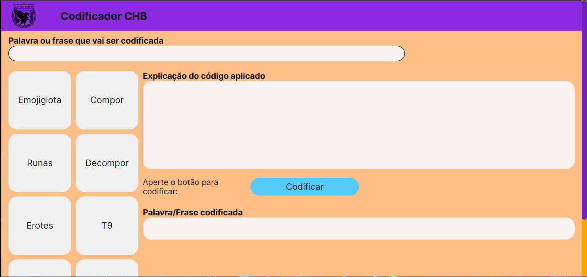
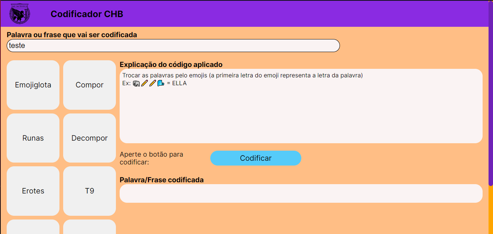
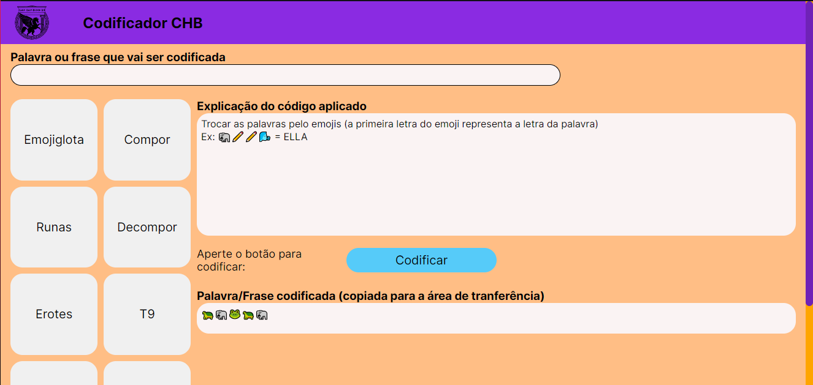

# Codificador CHB
Projeto pessoal realizado para facilitar a aplicação de códigos e enigmas enviados de forma online via Whatsapp.

# Índice
- [Informações sobre o projeto](#info)
- [Pré-requisitos](#prerequisitos)
- [Uso](#uso)

# Informações sobre o projeto
O Projeto teve como base um projeto feito por Fernanda Figueiró e Igor Cesar (devidamente creditados ao final da aplicação) em que o usuário digitava uma palavra, selecionava um código e ele aparecia na área de transferência.  
A aplicação aqui apresentada continua com essa funcionalidade, além de trazer mais códigos, mostrar a explicação de cada código e o usuário visualiza o conteúdo codificado.

# Pré-requisitos
Para essa aplicação, apenas é necessário um navegador web.
   

# Uso 

Abra a aplicação usando seu navegador web neste link:  [Clique aqui](https://codificador-chb.vercel.app).

Assim que o site for aberto, ele terá essa interface inicial:

 
 Inicialmente você pode escrever a palavra ou frase que queira codificar.

 Em seguida, clique em algum código que queira aplicar na frase digitada.

 Caso não conheça os códigos, não tem problema: toda vez que um botão de código é clicado, aparece uma breve explicação no campo "Explicação do códdigo selecionado", como o exemplo abaixo, para o caso de selecionar o botão "Emogiglosa".

 

 Em seguida, clique em "Codificar", e o código aparecerá codificado no campo "Palavra/Frase codificada" (que terá a mensagem "copiado para sua área de transferência" acrescentada), como no exemplo abaixo:

  
